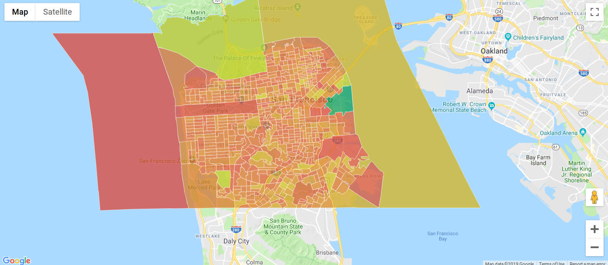

# Showing US Census Data on Google Maps with PostgreSQL

This repo represents a basic proof of concept for using PostgreSQL with the PostGIS extension served with PostgREST to generate Google Maps.

The included database dump is populated with demographics (total population for San Francisco at block group level) from
[factfinder.census.gov](https://factfinder.census.gov) and [TIGER/Line® Shapefiles](https://www.census.gov/cgi-bin/geo/shapefiles/). Linking these tables within
the database and wrapping them with some views and functions allows the data to very easily be displayed in Google Maps with the maps api using map.data.addGeoJson().

This is just a simple demo, there are plenty of optimizations and work to be done for a production version. It took nearly a week to figure out and get working, so I post this as
is in the hope it can save somebody that time getting started on their system.

[Demo](http://webanet.com.au/projects/pg-gis-maps/)

#### Screenshot showing block groups for San Francisco


In the setup code below **replace**: *{your-db-name}* *{your-table-name}* *{your-db-username}* *{your-db-password}*

with values for your environment. (Yes, the curly brackets too). Run commands from the repo's root directory.

## Installation and Usage

- Install the pre-requisites, PostgreSQL, PostGIS and PostgREST. Ubuntu instructions can be found [here](docs/install.md) - windows users should format their hard drive and install Ubuntu immediately but Mac users ought to be able to translate the instructions without too much difficulty.
- [Download](https://github.com/webanet-australia/postgres-census-poc/archive/master.zip) or clone this repo.
- Create a new database and restore dump.

  ```bash
  $ cd repo/root-directory
  $ psql
  ```

  ```sql
  # CREATE DATABASE {your-db-name};
  # \q
  ```

  ```bash
  $  pg_restore -U postgres -d {your-db-name} -1 db/pg-census-poc.dump
  ```
- Edit PostgREST configuration with details of your environment (pretty self explanatory) but the documentation can be [found here](http://postgrest.org/en/v6.0/install.html#configuration)
- Start PostgREST

  ```bash
  $ bin/postgrest conf/postgrest.conf
  ```
- File open /san-francisco.html in your browser.

---

## Downloading and importing other data

Check out [docs/data.md](docs/data.md) for details on downloading and importing more data.

---

#### References:
- [https://tilemill-project.github.io/tilemill/docs/guides/postgis-work/](https://tilemill-project.github.io/tilemill/docs/guides/postgis-work/)
- [https://sparkgeo.com/blog/building-a-us-census-tracts-postgis-database/](https://sparkgeo.com/blog/building-a-us-census-tracts-postgis-database/)
- [https://gis.stackexchange.com/questions/14514/exporting-feature-geojson-from-postgis](https://gis.stackexchange.com/questions/14514/exporting-feature-geojson-from-postgis)
- [https://developers.google.com/maps/documentation/javascript/combining-data](https://developers.google.com/maps/documentation/javascript/combining-data)

#### Data:
- [https://factfinder.census.gov/faces/nav/jsf/pages/index.xhtml](https://factfinder.census.gov/faces/nav/jsf/pages/index.xhtml)
- [https://www.census.gov/cgi-bin/geo/shapefiles2010/main](https://www.census.gov/cgi-bin/geo/shapefiles2010/main)
